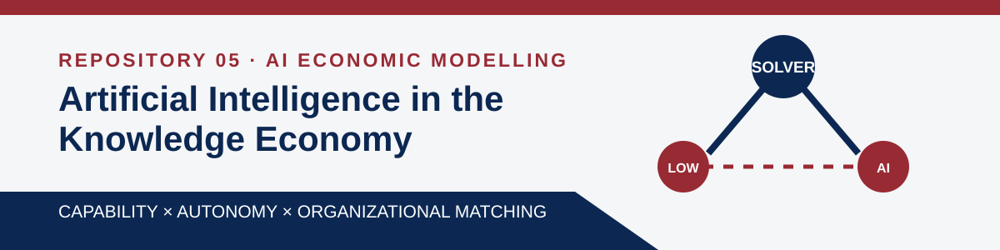

<p align="center">
  
</p>

<p align="center">
  <a href="paper/ide-talamas-2025.pdf"></a>
  <a href="https://doi.org/10.1086/737233"></a>
  <a href="presentation.pdf"></a>
  <a href="extra/presentation-long.pdf"></a>
  <a href="extensions.md"></a>
  <a href="lean/README.md"></a>
</p>

<p align="center">
  
  
  
  
  
  <a href="LICENSE.md"></a>
</p>

# Artificial Intelligence in the Knowledge Economy

**Enrique Ide and Eduard Talamàs (2025), _Journal of Political Economy_ 133(12), 3762–3800.** This is the refereed article—not the earlier 2024 working-paper version. [Published article](https://doi.org/10.1086/737233) · [accepted manuscript](https://arxiv.org/abs/2312.05481)

## Question and mechanism

How do AI capability and autonomy change the organization of knowledge work, total output, and the distribution of labor income? The paper places scalable AI inside a Garicano-style hierarchy. Less knowledgeable **workers** attempt problems; **solvers** handle the exceptions. An AI of knowledge $z_{AI}$ can supply advice; when autonomous, it can also pursue production opportunities on its own. The single mechanism is organizational matching: AI changes who works for whom and how the surplus of a hierarchy is divided.

Humans are risk-neutral and maximize income. A competitive firm chooses an organization and, in a two-layer human team, a solver $s$ for workers of knowledge $z$:

$$\max_{s\ge z}\; n(z)\,[s-w(z)]-w(s), \qquad n(z)=\frac{1}{h(1-z)}.$$

With autonomous AI, the firm also compares independent production and the two automated hierarchies:

$$z_{AI}-r,\quad n(z)[z_{AI}-w(z)]-r,\quad n(z_{AI})[s-r]-w(s).$$

Competitive entry drives the chosen activity's profit to zero. The model assumes observable human knowledge $z\in[0,1]$, a continuous strictly positive density, problem difficulty uniform on $[0,1]$, help cost $h\in(0,1)$, at most two layers, and compute abundant relative to human time. Sections 5–6 additionally maintain $h<h_0$ and $z_{AI}<1$.

## Main result—and the condition the slogan misses

Let $w$ be the pre-AI wage, $w^*$ the autonomous-AI wage, and $w^\star$ the non-autonomous-AI wage. Define bottom and top winners under autonomous AI by $B=\{z\le z_{AI}:w^*(z)>w(z)\}$ and $T=\{z\ge z_{AI}:w^*(z)>w(z)\}$.

**Proposition 5.** Under the maintained assumptions above,

$$B\ne\varnothing \iff z_{AI}>\bar z_{AI},\quad \bar z_{AI}\in\operatorname{int}W; \qquad T\ne\varnothing\quad\forall z_{AI}\in[0,1).$$

Thus autonomous AI always produces some winners at the top, but it produces winners at the bottom only when it is capable enough. The top result relies on $h<h_0$; the paper notes it may fail when $h\ge h_0$.

**Proposition 6.** If AI is non-autonomous, the equilibrium is unique and efficient and $r^\star=0$. If $z_{AI}\le w(0)$, AI is unused and wages and occupations remain pre-AI. If $z_{AI}>w(0)$, only the least knowledgeable use AI as solver. In either case, autonomous AI yields strictly more output; non-autonomous AI creates some weak losers; a neighborhood of the bottom weakly prefers non-autonomous AI to both alternatives (strictly if $z_{AI}>w(0)$); and a neighborhood of the top prefers autonomous AI (strictly except at $z=1$).

> **Verdict.** “Distribution is driven by autonomy, not capability” is incomplete. Autonomy determines which roles AI may occupy, but capability determines whether autonomous AI creates bottom winners ($z_{AI}>\bar z_{AI}$) and whether non-autonomous AI is used at all ($z_{AI}>w(0)$).

## Repository map

```text
.
├── assets/                 # banner and shared Beamer style
├── extra/
│   ├── figures/            # reproducible discrete-model figure
│   └── presentation-long.* # 26-frame oral-exam deck
├── hand/                   # add your own handwritten photo here
├── lean/                   # Lean 4 proof interfaces and axiom audit
├── paper/                  # accepted manuscript and provenance
├── presentation.tex/.pdf  # required five-frame deck
├── discrete_model.py       # symbolic and numerical checks
├── extensions.md           # derivation, caveats, limiting cases
└── prompts.md              # raw AI interaction record
```

Run `python discrete_model.py` to reproduce the checks and figure, and compile the decks with LuaLaTeX. The matching Lean target `IT25AIKnowledgeEconomy` builds successfully in EconCSLib: all three public proof endpoints contain no `sorry`, and `lean/AxiomAudit.lean` reports only Lean/mathlib's standard foundations. See [`lean/README.md`](lean/README.md) for the exact scope. **Before submission, replace the placeholder in `hand/` with a real photo of your own derivation.**
